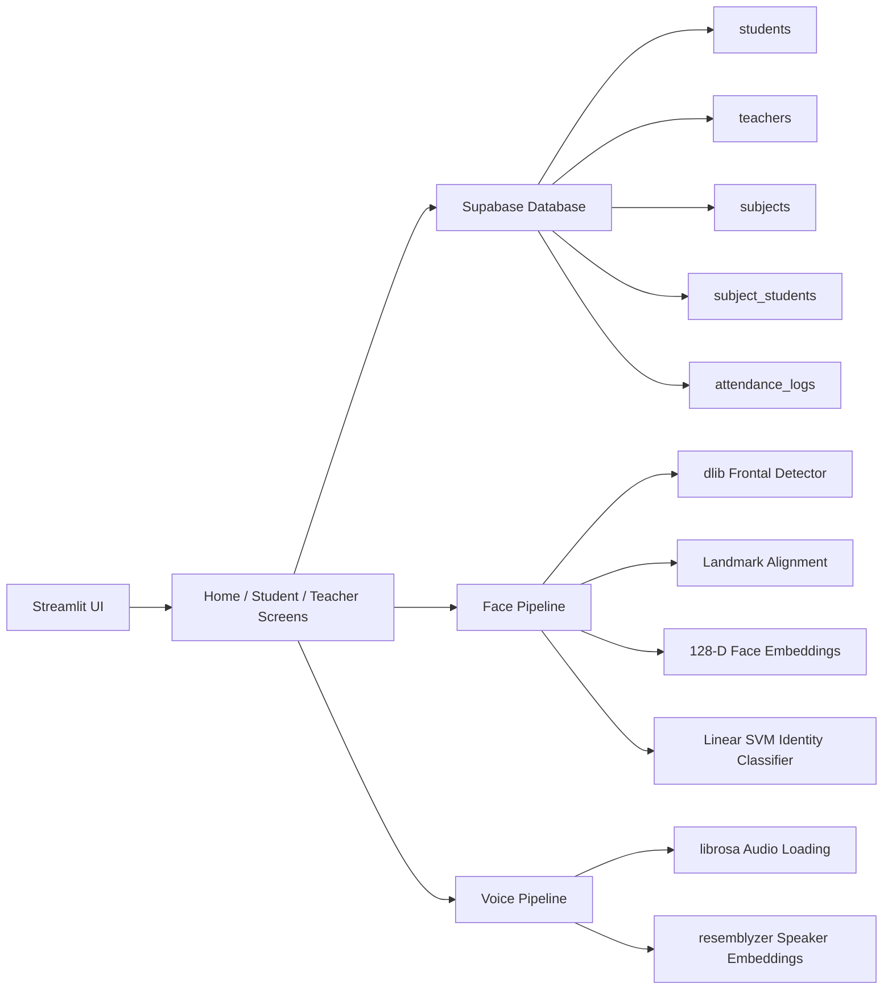

# GazeHum: Intelligent AI Attendance System

[](https://streamlit.io/)
[](https://supabase.com/)
[](https://www.python.org/)
[](https://github.com/ageitgey/face_recognition)
[](https://github.com/resemble-ai/Resemblyzer)

GazeHum is a production-oriented attendance platform for academic environments that need fast identity verification, dependable enrollment workflows, and a clean operational dashboard. The application pairs a modern Streamlit interface with a modular computer-vision pipeline for face recognition and an optional voice embedding path for multimodal expansion.

## What It Does

The system is organized around three user journeys:

- a public landing page that routes users into the student or teacher experience,
- a student workflow for FaceID login, subject enrollment, and personal attendance visibility,
- a teacher workflow for subject creation, classroom capture, and attendance review.

The implementation is intentionally lean and operationally simple: Streamlit session state handles navigation, Supabase persists application data, and inference is cached where it matters for responsiveness.

## System Architecture



## ML / CV Pipeline

The face stack is built around `dlib` and `face_recognition_models`:

1. **Face detection** locates candidate faces in registration and classroom images.
2. **Landmark estimation** aligns each face before feature extraction.
3. **Embedding extraction** generates a 128-dimensional descriptor per face.
4. **Classification** trains a linear SVM over stored student embeddings.
5. **Verification** applies a distance threshold to suppress weak matches.

The voice path uses `resemblyzer` and `librosa`:

1. **Waveform normalization** loads audio at 16 kHz.
2. **Speaker embedding** converts the waveform into a vector representation.
3. **Similarity scoring** compares the embedding against stored voice vectors.

This architecture keeps the primary identity path focused on face recognition while leaving room for multimodal enrollment and later extension.

## UI / UX System

The interface follows a consistent academic visual language defined in `src/ui/base_layout.py` and `.streamlit/config.toml`.

- Shared card-based layout across home, student, and teacher views
- Centralized typography, spacing, and button styling
- Responsive Streamlit containers for desktop and tablet usage
- Local branding asset loaded from `assets/Screenshot 2026-05-15 152619.png`

## Screens

### Home


## Core Capabilities

- Student registration via FaceID capture
- Teacher authentication and dashboard access
- Subject creation and enrollment management
- Subject enrollment by code
- Optional join-code auto-enrollment through the URL query string
- Face-based attendance scanning from uploaded classroom images
- Attendance log generation and review
- Supabase-backed persistence for students, teachers, subjects, enrollments, and attendance records

## Repository Layout

- `app.py` - Streamlit entry point and top-level routing
- `src/screens/` - Home, student, and teacher application surfaces
- `src/components/` - Shared dialogs, header/footer modules, and subject cards
- `src/database/` - Supabase client setup and database access functions
- `src/pipelines/` - Face and voice inference helpers
- `src/ui/base_layout.py` - Global theme and layout styling
- `supabase_schema.sql` - Database schema for local provisioning or reset

## Setup

### Prerequisites

- Python 3.9 or newer
- A configured Supabase project

### Install

```bash
pip install -r requirements.txt
```

### Configure Secrets

Create `.streamlit/secrets.toml` or set environment variables with:

```toml
SUPABASE_URL = "your-supabase-url"
SUPABASE_KEY = "your-supabase-key"
```

### Database

If you are provisioning a fresh backend, apply `supabase_schema.sql` in the Supabase SQL editor. The schema defines:

- `teachers`
- `students`
- `subjects`
- `subject_students`
- `attendance_logs`

### Run

```bash
streamlit run app.py
```

## Implementation Notes

- Student enrollment data is stored in `subject_students` and is read directly by the teacher dashboard.
- Face embeddings are cached and the SVM model is retrained from stored student embeddings when the cache is refreshed.
- The teacher attendance flow reads enrolled students from Supabase and matches detected faces against stored identities.
- If you change the branding image, update `app.py` and the shared header component accordingly.

## Credit

Developed by Nancy Kumari for an academic attendance use case.
